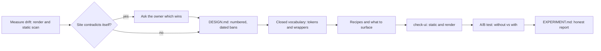
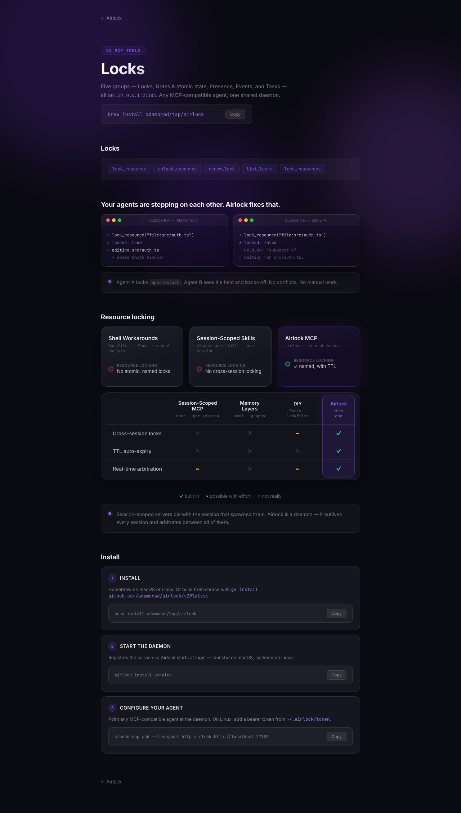
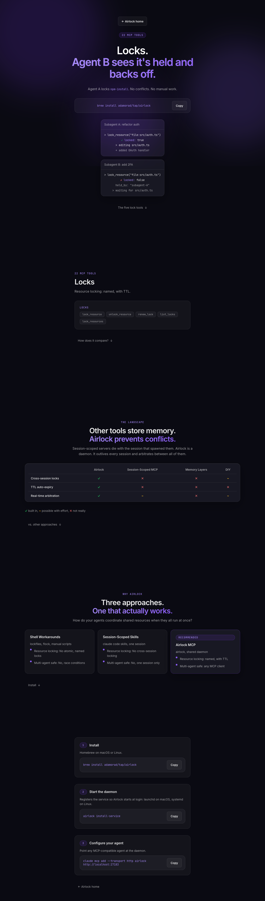

<div align="center">

# design-law

**An agent-first design system you can test.**

Numbered, dated bans in one `DESIGN.md`. A closed vocabulary so the wrong value can't be typed. Recipes for your page shapes. A checker that cites the rule it enforces. An A/B protocol to find out whether any of it changes what an agent builds.

[](LICENSE)
[](#install)
[](plugins/design-law/skills/design-law/SKILL.md)
[](plugins/design-law/skills/design-law/tools/check-ui)
[](plugins/design-law/skills/design-law/tools/lib/render-metrics.ts)
[](https://github.com/adamorad/design-law/stargazers)
[](https://github.com/adamorad/design-law/commits/main)

[**Install**](#install) &nbsp;·&nbsp; [**Quick start**](#quick-start) &nbsp;·&nbsp; [**How it works**](#how-it-works) &nbsp;·&nbsp; [**The checker**](#the-checker) &nbsp;·&nbsp; [**Results**](#results-from-the-worked-example) &nbsp;·&nbsp; [**Example**](examples/airlock) &nbsp;·&nbsp; [**FAQ**](#faq)

</div>

---

## Why

Agents write UI that is fine and indistinguishable: a gradient hero, soft shadows, a third grey for secondary text, `text-[13px]` because the scale didn't have 13. Style guides written as prose don't stop that, because the agent reads them once and then copies the nearest neighbouring file.

This skill tests a different method, from Mate Security's article *"A Design System In and For the Agentic Era"*:

- Write the rules as **numbered, dated bans** with the reason (and a number) inline.
- Make the rules **unbreakable by construction**: a closed vocabulary of tokens and wrapper components, so product code can only use approved values.
- Give agents **recipes** for the shapes your site repeats, each ending in a "what to surface" step so rules don't replace product thinking.
- Run a **checker** where every finding cites a `DESIGN.md` section and a fix.
- And then **measure** whether any of it changed what an agent builds.

This repo is the skill that does all of that on an existing codebase, plus the tools it uses and a full worked run on a real portfolio site, including the parts that did not go well.

> **Read [the results](#results-from-the-worked-example) before you adopt it.** In the worked example the checker caught nothing on the agent that read the rules, and the page that passed with zero findings was the weaker one by eye. The method buys consistency, not taste.

## What you get

| Piece | What it is | Where |
|---|---|---|
| **Skill** | A phased workflow an agent follows on your repo: recon, baseline drift, decide, write the law, vocabulary, recipes, checker, A/B test, report | [`SKILL.md`](plugins/design-law/skills/design-law/SKILL.md) |
| **`DESIGN.md` template** | Numbered sections, absolute rules, `Decided <date>`, adoption counts, "neighbour is debt" clause | [`references/DESIGN.template.md`](plugins/design-law/skills/design-law/references/DESIGN.template.md) |
| **Render audit** | Playwright at 1280 and 390, light and dark: distinct sizes, weights, colours, radii, shadows, contrast (opacity and stacked backgrounds composited), overflow, clipping, overlap | [`tools/render-audit.ts`](plugins/design-law/skills/design-law/tools/render-audit.ts) |
| **Static scans** | Counts colour literals, arbitrary Tailwind values, inline styles, opacity-muted colours, duplicate class strings (`scan-static.ts`, TSX/Tailwind) or colour literals, font sizes, radii, shadows, gradients, blur, dead classes (`scan-css.ts`, plain CSS) | [`tools/`](plugins/design-law/skills/design-law/tools) |
| **`check-ui`** (React + Tailwind) | 25 static rules (TypeScript AST) plus a render check, each finding citing a `DESIGN.md` section and a fix | [`tools/check-ui`](plugins/design-law/skills/design-law/tools/check-ui) |
| **`check-ui-css`** (HTML + plain CSS) | 24 static rules (parse5 + postcss) plus a render check that also flags a scrolling table hiding its key column | [`tools/check-ui-css`](plugins/design-law/skills/design-law/tools/check-ui-css) |
| **Edit hook** | A PostToolUse hook that runs the checker on every file the agent writes and feeds findings back (exit 2), so the law binds even when the prompt forgets to say so; logs findings per check | [`tools/hooks`](plugins/design-law/skills/design-law/tools/hooks/check-on-edit.mjs) |
| **Computed-style law** | `design-law.json` lists the allowed sizes, weights, families, radii and shadows; the render check flags any element whose *computed* style is outside it, including browser defaults | [`tools/lib/computed-law.ts`](plugins/design-law/skills/design-law/tools/lib/computed-law.ts) |
| **Recipe + wrapper guides** | How to write recipes and the vocabulary without leaving escape hatches | [`references/`](plugins/design-law/skills/design-law/references) |
| **Worked example** | A full run on a real Vite site (airlock-web.vercel.app): law, `ds.css` vocabulary, 5 recipes, A/B artifacts, screenshots, report | [`examples/airlock`](examples/airlock) |

## Install

### Claude Code (plugin marketplace)

```
/plugin marketplace add adamorad/design-law
/plugin install design-law@design-law
```

### Any agent that reads `SKILL.md`

```bash
git clone https://github.com/adamorad/design-law.git
cp -R design-law/plugins/design-law/skills/design-law ~/.claude/skills/design-law
```

### Just the tools (no agent)

```bash
mkdir -p design-system && cp -R design-law/plugins/design-law/skills/design-law/tools/. design-system/
cd design-system && npm install
npx playwright install chromium   # skip if you already have it
```

Requirements: Node 20+. Two static checkers: `check-ui` for **React/TSX with Tailwind**, `check-ui-css` for **HTML with plain CSS** (the one the worked example uses). The render audit works on any site you can serve. The tools were tested on Node 26, Playwright 1.63, TypeScript 5.9 and tsx 4.

## Quick start

In the repo you want to govern, tell your agent:

```text
Use the design-law skill on this repo. Branch design-law-experiment, don't touch how the live site looks,
and stop to ask me before you write any rule where the site contradicts itself.
```

It will:

1. Branch (in a worktree if your tree is dirty) and summarise the stack.
2. Render every page and scan the source, saving `baseline.json` and screenshots.
3. **Stop and show you the conflicts** with counts: "3 card title sizes, 3 button hovers, 7 opacity-faded colours". You pick winners.
4. Write `DESIGN.md`, tokens and wrapper components, recipes, and the checker, committing after each phase.
5. Run two sub-agents on the same brief, one without the system and one with it, and measure both.
6. Write `EXPERIMENT.md`, with the top 5 fixes for your existing site and **without applying them**.

Run the tools yourself at any time:

```bash
cd design-system
npm test                                                     # checker self-tests
npx tsx check-ui/index.ts src/app/new-page                   # React/Tailwind static check, exits 1 on findings
DS_CSS=src/ds.css npx tsx check-ui-css/index.ts pages/new.html   # HTML/CSS variant
npx tsx check-ui/index.ts src --render http://localhost:3000 --routes /,/new-page
npx tsx render-audit.ts --base http://localhost:3000 --routes / --out shots --label baseline --json baseline.json
```

`npm test` / `npm run test:css` expect a project layout: a `DESIGN.md`, `recipes/examples/` and your vocabulary (wrapper folder or `ds.css`, via `DS_CSS`), because the tests check that recipe examples pass and every rule cites a real section. Run them after the skill's phases 3 to 5, not on the bare tools.

## How it works



### A rule looks like this

```markdown
1.3 **No opacity modifier on any colour (`/40`, `/80`, `bg-black/10`) and no `opacity-*` utility
outside the button wrapper.** If a translucent colour is needed it becomes a token.
*Why:* opacity is how muted text sneaks in. Faded text on a faded fill has no number to audit;
the measured contrast of `muted` (5.08:1 on `background`) is only true at full alpha.
*Adoption:* 7 colour-opacity violations; 2 `opacity-90` hovers (allowed only inside `ds/button`).
*Decided 2026-10-06.* Lost: allowing opacity on non-text only.
```

Every rule has the reason with a number, the current adoption count, the date, and the options that lost. The file opens with: **"If neighbouring code contradicts this file, the neighbour is debt, not an example."**

### The closed vocabulary

Product code may use layout utilities (`flex`, `grid`, `gap-5`, `px-6`) and the wrappers, nothing else:

```tsx
import { Section, Heading, Text, Button } from "@/components/ds";

<Section id="contact">
  <Heading level="section">Get in touch</Heading>
  <Text variant="intro">Open to interesting problems and the odd consulting project.</Text>
  <Button href="https://example.com">Contact</Button>
</Section>
```

`text-lg`, `rounded-3xl`, `shadow-xl`, `bg-gray-100` do not appear in product code, so they cannot be wrong. Wrappers expose closed unions (`level="page" | "section" | "card" | "card-featured"`), never a free class string for type or colour. In a site without components the vocabulary is a stylesheet of `ds-*` classes: see [`examples/airlock/airlock-web/src/ds.css`](examples/airlock/airlock-web/src/ds.css). Pages may use only those classes, no inline styles and no page CSS.

### Recipes

One file per recurring shape (hero, project grid, featured item, repo list, contact): when to use, when not, anatomy, rules obeyed, a typechecked example to copy, and a **What to surface** step, e.g. *"lead the description with the distinctive fact already in the text; if the first clause is generic, either rewrite it from the site's own words or don't feature the item."* See [`examples/airlock/design-system/recipes`](examples/airlock/design-system/recipes).

## The checker

### `check-ui` (React + Tailwind)

`check-ui` parses TSX with the TypeScript compiler API, so it sees class strings in `className`, in `const CARD = "..."` strings, in template literals, in `style={{}}` objects, raw `<h2>`/`<button>` elements, and copy (emoji, em dashes, invented proof).

| Rule | Cites | What it flags |
|---|---|---|
| `UI01` | §1.1 | Palette colour or black/white instead of a token |
| `UI02` | §1.2 | Colour literal in a class (hex, rgb, hsl, oklch) |
| `UI03` | §1.3 | Opacity modifier on a colour |
| `UI04` | §1.3 | opacity-* utility in product code |
| `UI05` | §1.6 | Gradient |
| `UI06` | §1.6 | Blur, glass or glow |
| `UI07` | §2.2 | Font weight other than 400/500, or a weight utility in product code |
| `UI08` | §2.3 | Raw text size |
| `UI09` | §2.4 | Tracking, case, italic or leading set by hand |
| `UI10` | §2.1 | Font family other than Geist Sans |
| `UI11` | §3.1 | Radius utility in product code |
| `UI12` | §3.2 | Hand-built border or divider |
| `UI13` | §4.1 | Shadow or ring |
| `UI14` | §5.6 | Arbitrary value in product code |
| `UI15` | §5.1 | Content width other than max-w-5xl or max-w-intro |
| `UI16` | §5.8 | Width that can force sideways scroll at 390px |
| `UI17` | §7.1 | Hover scale, translate, rotate or looping animation |
| `UI18` | §10.1 | dark: variant |
| `UI19` | §0.2 | Token colour utility written by hand in product code |
| `UI20` | §2.3 | Raw heading or paragraph element |
| `UI21` | §6.3 | Raw button element |
| `UI22` | §6.5 | Emoji or decorative symbol in copy |
| `UI23` | §8.2 | Em dash, en dash or smart quote in copy |
| `UI24` | §8.1 | Invented proof or marketing filler |
| `UI25` | §5.7 | Inline style with a static value |

### `check-ui-css` (HTML + plain CSS)

Parses HTML with parse5 and CSS with postcss. In pages, only `ds-*` classes that exist in `ds.css` are allowed; no inline `style`, no `<style>`, no page CSS. Stylesheets outside `ds.css` are checked declaration by declaration.

| Rule | Cites | What it flags |
|---|---|---|
| `UI01` | §0.2 | Class not from the ds-* vocabulary |
| `UI02` | §0.2 | ds-* class that ds.css does not define |
| `UI03` | §0.2 | Inline style attribute |
| `UI04` | §0.2 | <style> element in a page |
| `UI05` | §0.2 | Stylesheet or script other than the shell |
| `UI06` | §9.2 | Emoji or decorative symbol in copy |
| `UI07` | §9.1 | Invented proof or marketing filler |
| `UI08` | §2.3 | Heading element without its ds class, h4-h6, or more than one h1 |
| `UI09` | §6.5 | Table outside ds-table-wrap or without ds-table |
| `UI10` | §7.2 | Raw <button> without ds-btn |
| `UI11` | §7.5 | Status glyph without an accessible name |
| `UI12` | §0.2 | Presentational element or attribute |
| `UI13` | §6.4 | Positional section name (foldN, section-N) |
| `UI14` | §7.3 | Copy row without a wrapping ds-copy-row, or code without an id |
| `UI15` | §1.2 | Colour literal outside the token block |
| `UI16` | §2.3 | Font size outside the role table |
| `UI17` | §2.2 | Font weight other than 400, 500, 600 |
| `UI18` | §3.1 | Border radius outside 8px, 16px, pill, 50% |
| `UI19` | §4.2 | Shadow, glow, blur or filter outside the surface tokens |
| `UI20` | §5.1 | Gradient other than the two text gradients |
| `UI21` | §6.2 | Spacing off the 4/8/12/16/24/32/48/64 scale |
| `UI22` | §8.1 | Animation, keyframes or hover transform |
| `UI23` | §2.4 | Uppercase or letter-spacing outside ds-label |
| `UI24` | §0.2 | Page-specific stylesheet |
| `R01` | §1.6 | Text under 4.5:1 contrast (3:1 at 24px+) |
| `R02` | §6.5 | Page scrolls sideways or element extends past the viewport |
| `R03` | §7.3 | Text clipped by its container |
| `R04` | §6.5 | Text overlapping text |
| `R05` | §6.5 | Scrolling table hides its Airlock column at 390px |

The render check (`--render <url>`) covers what static rules can't see: contrast under 4.5:1 (3:1 for large text), sideways scroll and elements past the viewport at 390px, text clipped by its container, text overlapping text.

```text
src/app/work/page.tsx:18  UI08 DESIGN.md 2.3  Raw text size (text-[13px])
    <p className="mt-4 text-[13px] text-gray-400">
    fix: Use Heading level=page|section|card|card-featured, or Text variant=intro|body|small, or Tag.
```

**Adapting it:** `rules.ts` is the default Tailwind/React rule set. Edit it so each rule matches a rule in *your* `DESIGN.md` and cites that section number; the test suite fails if a rule cites a section that doesn't exist, if any rule never fires on the "don't" fixture, or if a tagged fixture line goes unflagged.

## Making it bind

### Edit hook

The first two runs only ran the checker because the prompt told the agent to. The hook removes that dependency: after every `Edit`, `Write` or `MultiEdit`, it runs the project's `check-ui` on that file. Findings go back to the agent (exit code 2, stderr); a clean file is silent.

- **Plugin install:** automatic (`hooks/hooks.json`); it does nothing in projects without `design-system/`.
- **Manual:** the tools copy includes `design-system/hooks/check-on-edit.mjs`. Add to `.claude/settings.json`:

```json
{
  "hooks": {
    "PostToolUse": [
      {
        "matcher": "Edit|Write|MultiEdit",
        "hooks": [{ "type": "command", "command": "node \"$CLAUDE_PROJECT_DIR/design-system/hooks/check-on-edit.mjs\"" }]
      }
    ]
  }
}
```

Tested end to end with headless Claude, both as a project setting and through `--plugin-dir`: asked to write a page with an inline style and an invented class, the agent received the two findings (with section numbers and fixes) and replaced them with vocabulary classes. The hook appends `{file, findings}` per check to `design-system/.hook-log.jsonl`, which gives A/B runs the first-draft finding count automatically. The hook runs after the write, so the file exists briefly in its bad state; it cannot prevent the edit. When a user instruction conflicts with the law, the agent in the test kept the violation and said so.

### Computed-style law

Source rules cannot see browser defaults. In the worked example, B's table headers rendered at weight 700 because nothing set `th`, and the law bans 700. `design-law.json` (template: [`references/design-law.template.json`](plugins/design-law/skills/design-law/references/design-law.template.json)) states the allowed computed values and the `DESIGN.md` section each cites; `check-ui --render` then reads every visible element's computed style:

| Rule | Flags |
|---|---|
| `R06` | font size outside the allowed px list and fluid ranges |
| `R07` | font weight outside the allowed list (browser defaults included) |
| `R08` | font family outside the allowed list |
| `R09` | border radius outside the allowed list (pill and circle opt-in) |
| `R10` | shadow outside the allowed list |

On the Airlock pages it found B's four `th` cells at weight 700 and nothing else, and flagged 12 radii, 12 shadow variants and 5 stray font sizes on A and the legacy home page. A test renders every recipe example against the law, so a vocabulary gap fails the suite instead of surfacing in a page.

## Results from the worked example

Subject: airlock-web.vercel.app, a one-page dark Vite site (vanilla HTML and CSS, violet glass cards, gradient headline, drifting orbs). The brief: *add a detail page for the Locks tool group using only text already on the home page*. Arm A branched from before the vocabulary existed (no `ds.css`, no config, no docs). Arm B had `DESIGN.md`, recipes, `ds.css` and the checker. Full write-up: [`examples/airlock/design-system/EXPERIMENT.md`](examples/airlock/design-system/EXPERIMENT.md).

| Dark, per width | Existing home page | A (no system) | B (with system) |
|---|---|---|---|
| Distinct font sizes | 21 | 15 | 8 |
| Radii | 12 | 12 | 4 |
| Box-shadow values | 8 | 8 | 1 |
| Text under 4.5:1 contrast | 91 | 35 | **0** |
| Airlock column hidden at 390px | yes | yes | no |
| `check-ui-css` findings | 701 | 186 | **0, on the first draft** |
| Page height at 1280px | n/a | 2,256px | 4,336px |

| A (no system) | B (with system) |
|---|---|
|  |  |

**What it showed, honestly:**

- B's first checker run found **nothing**. B assembled its page from recipe examples, which pass the checker by construction. The checker's detection is proven by its fixture tests (the "don't" files trip every rule), not by this run.
- B is cleaner on every audited number, but largely because A **reused the home page's existing classes and inherited all of its debt**, while B reused `ds.css`. That is a difference between reusing legacy and reusing the new vocabulary, not proof the rules improve a page.
- By eye, **A's page is better**: compact, well ordered, verdicts readable at a glance. B's page is twice as tall, with four full-height sections and big empty gaps, repeats its "Locks" heading, and stacks the two hero terminals in one narrow column at 1280px. The static check and the render check both passed it.
- The run exposed gaps in the system itself: `100svh` sections are the wrong default for a detail page, there is no detail-page recipe, the hero recipe causes the stacked terminals, and `ds.css` never set a weight on `th`, so browsers bolded the table headers; the computed-style check confirmed those four cells as the only violation on B's page, and `ds.css` now sets it.
- The checker did catch real things outside the A/B: two mistakes in the recipe examples (an undefined class, status glyphs with no accessible name) and, on the legacy home page, 91 low-contrast elements, a hidden Airlock column at 390px and install commands truncated with an ellipsis.

Limits: one run per arm, same model in both, the rules were written by the person who ran the test, B knew it would be checked, one small task on a one-page site. Treat it as a method demonstration, not an effect size. The React + Tailwind checker was validated the same way on a Next.js portfolio site in an earlier run; that run is not included here.

## Phases

| # | Phase | Output | Stops for you? |
|---|---|---|---|
| 0 | Recon | 10-line stack summary | no |
| 1 | Baseline drift | `baseline.json`, screenshots, static counts | no |
| 2 | Decide, then write the law | conflicts table, then `DESIGN.md` | **yes, on every conflict** |
| 3 | Vocabulary | tokens, wrapper components | no |
| 4 | Recipes | recipe files with typechecked examples | no |
| 5 | Checker | `check-ui` + tests | no |
| 6 | A/B test | two worktrees, two agents, measurements | no |
| 7 | Report | `EXPERIMENT.md`, top 5 fixes (not applied) | no |

Guardrails baked into the skill: new branch only, never push or deploy, commit locally per phase, don't change how the live site looks, derive rules from what the site already does, no invented numbers.

## Repo layout

```text
.claude-plugin/marketplace.json
plugins/design-law/
  .claude-plugin/plugin.json
  hooks/hooks.json                  registers the edit hook
  skills/design-law/
    SKILL.md                      the workflow
    references/                   DESIGN / recipe templates, wrapper guide
    tools/                        copy into <project>/design-system/
      check-ui/                   rules.ts, static.ts, render.ts, tests, fixtures
      lib/render-metrics.ts       Playwright measurements
      check-ui-css/               HTML + plain CSS variant
      lib/computed-law.ts         design-law.json checker (R06-R10)
      hooks/check-on-edit.mjs     PostToolUse hook
      render-audit.ts  scan-static.ts  scan-css.ts
examples/airlock/                 a complete run on a real Vite site
  design-system/                  DESIGN.md  EXPERIMENT.md  recipes/  experiment/  shots/
  airlock-web/                    src/ds.css  src/ds.js  vite.config.js
```

## FAQ

**Does it work without Tailwind or React?** Yes. `check-ui-css` handles plain HTML and CSS (the worked example). For CSS modules or CSS-in-JS, adapt `rules.ts` in either checker.

**Will the checker flag my whole existing site?** Yes, by design: new code may only use the vocabulary, so every existing hand-written class or declaration counts as debt (701 findings on the Airlock home page). The skill records that number and does not migrate existing pages.

**Why ban `text-muted` in product code?** The rule is "type, colour, radius, border, shadow and opacity utilities live in the vocabulary". It is strict on purpose so that the first thing an agent has to do is reach for a wrapper. If that is too strict for you, relax rule `UI19` and record the decision in `DESIGN.md`.

**Does passing the checker mean the UI is good?** No. See the results. Hierarchy, content and layout need a person or a separate review.

**Can it run in CI?** `check-ui <paths>` exits 1 on findings and `--json <file>` writes them; the render check needs a served site.

## Contributing

Issues and PRs welcome. Useful contributions: rule sets for CSS modules and styled-components; a clean-control A/B recipe; more worked examples (especially larger sites and failures). Keep every rule absolute, cited and tested.

## Credits

Method from Mate Security's article *"A Design System In and For the Agentic Era"*. This repo is an independent implementation and test of it, and is not affiliated with Mate Security.

## License

[MIT](LICENSE)
