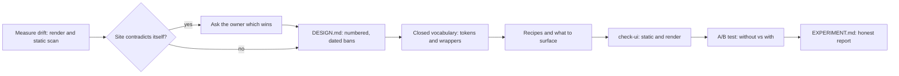
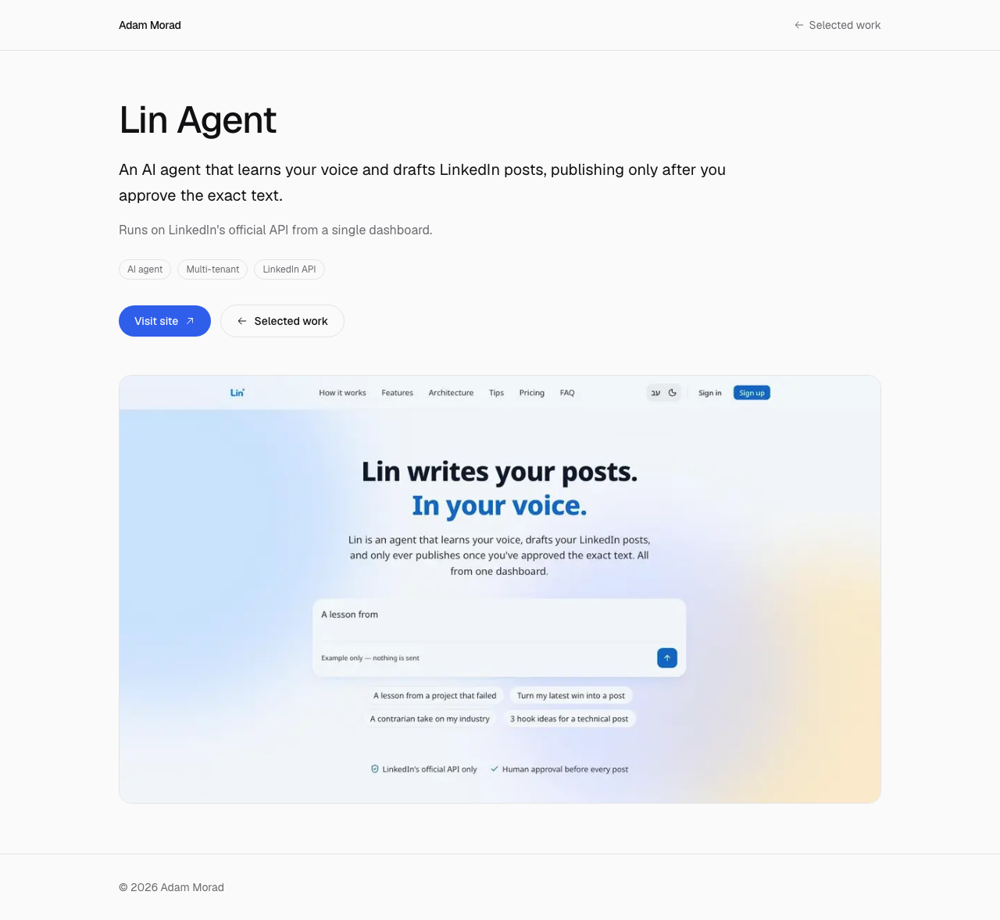
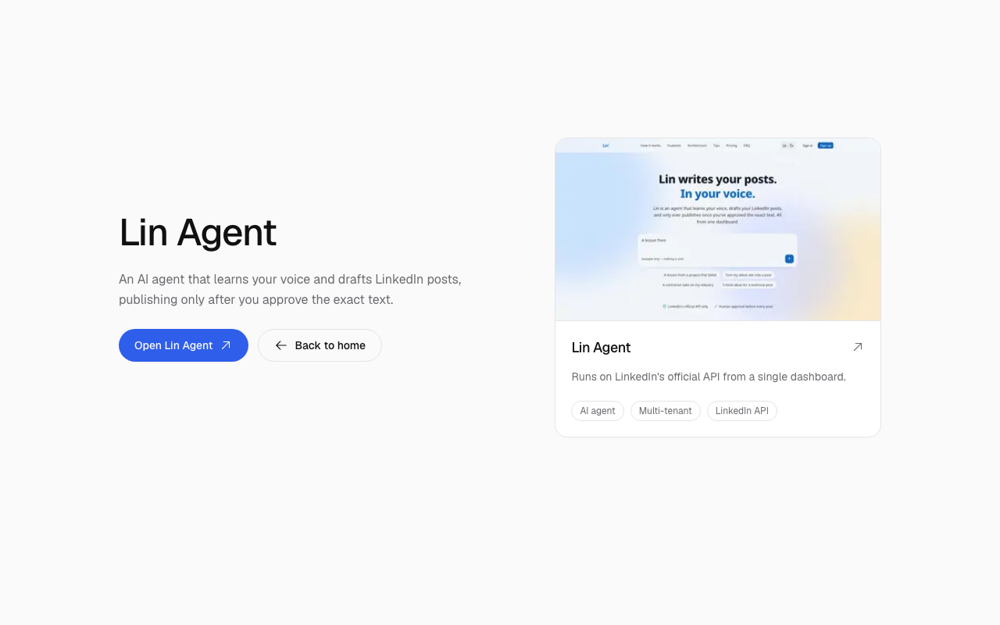

<div align="center">

# design-law

**An agent-first design system you can test.**

Numbered, dated bans in one `DESIGN.md`. A closed vocabulary so the wrong value can't be typed. Recipes for your page shapes. A checker that cites the rule it enforces. An A/B protocol to find out whether any of it changes what an agent builds.

[](LICENSE)
[](#install)
[](plugins/design-law/skills/design-law/SKILL.md)
[](plugins/design-law/skills/design-law/tools/check-ui)
[](plugins/design-law/skills/design-law/tools/lib/render-metrics.ts)
[](https://github.com/adamorad/design-law/stargazers)
[](https://github.com/adamorad/design-law/commits/main)

[**Install**](#install) &nbsp;·&nbsp; [**Quick start**](#quick-start) &nbsp;·&nbsp; [**How it works**](#how-it-works) &nbsp;·&nbsp; [**The checker**](#the-checker) &nbsp;·&nbsp; [**Results**](#results-from-the-first-run) &nbsp;·&nbsp; [**Example**](examples/portfolio) &nbsp;·&nbsp; [**FAQ**](#faq)

</div>

---

## Why

Agents write UI that is fine and indistinguishable: a gradient hero, soft shadows, a third grey for secondary text, `text-[13px]` because the scale didn't have 13. Style guides written as prose don't stop that, because the agent reads them once and then copies the nearest neighbouring file.

This skill tests a different method, from Mate Security's article *"A Design System In and For the Agentic Era"*:

- Write the rules as **numbered, dated bans** with the reason (and a number) inline.
- Make the rules **unbreakable by construction**: a closed vocabulary of tokens and wrapper components, so product code can only use approved values.
- Give agents **recipes** for the shapes your site repeats, each ending in a "what to surface" step so rules don't replace product thinking.
- Run a **checker** where every finding cites a `DESIGN.md` section and a fix.
- And then **measure** whether any of it changed what an agent builds.

This repo is the skill that does all of that on an existing codebase, plus the tools it uses and a full worked run on a real portfolio site, including the parts that did not go well.

> **Read [the results](#results-from-the-first-run) before you adopt it.** In the first run the checker caught nothing on the agent that read the rules, and the page that passed was the weaker one by eye. The method buys consistency, not taste.

## What you get

| Piece | What it is | Where |
|---|---|---|
| **Skill** | A phased workflow an agent follows on your repo: recon, baseline drift, decide, write the law, vocabulary, recipes, checker, A/B test, report | [`SKILL.md`](plugins/design-law/skills/design-law/SKILL.md) |
| **`DESIGN.md` template** | Numbered sections, absolute rules, `Decided <date>`, adoption counts, "neighbour is debt" clause | [`references/DESIGN.template.md`](plugins/design-law/skills/design-law/references/DESIGN.template.md) |
| **Render audit** | Playwright at 1280 and 390, light and dark: distinct sizes, weights, colours, radii, shadows, contrast (opacity and stacked backgrounds composited), overflow, clipping, overlap | [`tools/render-audit.ts`](plugins/design-law/skills/design-law/tools/render-audit.ts) |
| **Static scan** | Counts colour literals, arbitrary Tailwind values, inline styles, opacity-muted colours, duplicate class strings | [`tools/scan-static.ts`](plugins/design-law/skills/design-law/tools/scan-static.ts) |
| **`check-ui`** | 25 static rules (AST-based) plus a render check, each finding citing a `DESIGN.md` section and a fix | [`tools/check-ui`](plugins/design-law/skills/design-law/tools/check-ui) |
| **Recipe + wrapper guides** | How to write recipes and the vocabulary without leaving escape hatches | [`references/`](plugins/design-law/skills/design-law/references) |
| **Worked example** | A real run: law, wrappers, 5 recipes, A/B artifacts, screenshots, report | [`examples/portfolio`](examples/portfolio) |

## Install

### Claude Code (plugin marketplace)

```
/plugin marketplace add adamorad/design-law
/plugin install design-law@design-law
```

### Any agent that reads `SKILL.md`

```bash
git clone https://github.com/adamorad/design-law.git
cp -R design-law/plugins/design-law/skills/design-law ~/.claude/skills/design-law
```

### Just the tools (no agent)

```bash
mkdir -p design-system && cp -R design-law/plugins/design-law/skills/design-law/tools/. design-system/
cd design-system && npm install
npx playwright install chromium   # skip if you already have it
```

Requirements: Node 20+. The static checker targets **React/TSX with Tailwind**. The render audit works on any site you can serve. The tools were tested on Node 26, Playwright 1.63, TypeScript 5.9 and tsx 4.

## Quick start

In the repo you want to govern, tell your agent:

```text
Use the design-law skill on this repo. Branch design-law-experiment, don't touch how the live site looks,
and stop to ask me before you write any rule where the site contradicts itself.
```

It will:

1. Branch (in a worktree if your tree is dirty) and summarise the stack.
2. Render every page and scan the source, saving `baseline.json` and screenshots.
3. **Stop and show you the conflicts** with counts: "3 card title sizes, 3 button hovers, 7 opacity-faded colours". You pick winners.
4. Write `DESIGN.md`, tokens and wrapper components, recipes, and the checker, committing after each phase.
5. Run two sub-agents on the same brief, one without the system and one with it, and measure both.
6. Write `EXPERIMENT.md`, with the top 5 fixes for your existing site and **without applying them**.

Run the tools yourself at any time:

```bash
cd design-system
npm test                                                     # checker self-tests
npx tsx check-ui/index.ts src/app/new-page                   # static check, exits 1 on findings
npx tsx check-ui/index.ts src --render http://localhost:3000 --routes /,/new-page
npx tsx render-audit.ts --base http://localhost:3000 --routes / --out shots --label baseline --json baseline.json
```

`npm test` expects a project layout: a `DESIGN.md`, `recipes/examples/` and your wrapper folder, because its tests check that recipe examples pass and every rule cites a real section. Run it after the skill's phases 3 to 5, not on the bare tools.

## How it works



### A rule looks like this

```markdown
1.3 **No opacity modifier on any colour (`/40`, `/80`, `bg-black/10`) and no `opacity-*` utility
outside the button wrapper.** If a translucent colour is needed it becomes a token.
*Why:* opacity is how muted text sneaks in. Faded text on a faded fill has no number to audit;
the measured contrast of `muted` (5.08:1 on `background`) is only true at full alpha.
*Adoption:* 7 colour-opacity violations; 2 `opacity-90` hovers (allowed only inside `ds/button`).
*Decided 2026-10-06.* Lost: allowing opacity on non-text only.
```

Every rule has the reason with a number, the current adoption count, the date, and the options that lost. The file opens with: **"If neighbouring code contradicts this file, the neighbour is debt, not an example."**

### The closed vocabulary

Product code may use layout utilities (`flex`, `grid`, `gap-5`, `px-6`) and the wrappers, nothing else:

```tsx
import { Section, Heading, Text, Button } from "@/components/ds";

<Section id="contact">
  <Heading level="section">Get in touch</Heading>
  <Text variant="intro">Open to interesting problems and the odd consulting project.</Text>
  <Button href="https://example.com">Contact</Button>
</Section>
```

`text-lg`, `rounded-3xl`, `shadow-xl`, `bg-gray-100` do not appear in product code, so they cannot be wrong. Wrappers expose closed unions (`level="page" | "section" | "card" | "card-featured"`), never a free class string for type or colour. The wrappers from the example run are in [`examples/portfolio/ds`](examples/portfolio/ds).

### Recipes

One file per recurring shape (hero, project grid, featured item, repo list, contact): when to use, when not, anatomy, rules obeyed, a typechecked example to copy, and a **What to surface** step, e.g. *"lead the description with the distinctive fact already in the text; if the first clause is generic, either rewrite it from the site's own words or don't feature the item."* See [`examples/portfolio/recipes`](examples/portfolio/recipes).

## The checker

`check-ui` parses TSX with the TypeScript compiler API, so it sees class strings in `className`, in `const CARD = "..."` strings, in template literals, in `style={{}}` objects, raw `<h2>`/`<button>` elements, and copy (emoji, em dashes, invented proof).

| Rule | Cites | What it flags |
|---|---|---|
| `UI01` | §1.1 | Palette colour or black/white instead of a token |
| `UI02` | §1.2 | Colour literal in a class (hex, rgb, hsl, oklch) |
| `UI03` | §1.3 | Opacity modifier on a colour |
| `UI04` | §1.3 | opacity-* utility in product code |
| `UI05` | §1.6 | Gradient |
| `UI06` | §1.6 | Blur, glass or glow |
| `UI07` | §2.2 | Font weight other than 400/500, or a weight utility in product code |
| `UI08` | §2.3 | Raw text size |
| `UI09` | §2.4 | Tracking, case, italic or leading set by hand |
| `UI10` | §2.1 | Font family other than Geist Sans |
| `UI11` | §3.1 | Radius utility in product code |
| `UI12` | §3.2 | Hand-built border or divider |
| `UI13` | §4.1 | Shadow or ring |
| `UI14` | §5.6 | Arbitrary value in product code |
| `UI15` | §5.1 | Content width other than max-w-5xl or max-w-intro |
| `UI16` | §5.8 | Width that can force sideways scroll at 390px |
| `UI17` | §7.1 | Hover scale, translate, rotate or looping animation |
| `UI18` | §10.1 | dark: variant |
| `UI19` | §0.2 | Token colour utility written by hand in product code |
| `UI20` | §2.3 | Raw heading or paragraph element |
| `UI21` | §6.3 | Raw button element |
| `UI22` | §6.5 | Emoji or decorative symbol in copy |
| `UI23` | §8.2 | Em dash, en dash or smart quote in copy |
| `UI24` | §8.1 | Invented proof or marketing filler |
| `UI25` | §5.7 | Inline style with a static value |

The render check (`--render <url>`) covers what static rules can't see: contrast under 4.5:1 (3:1 for large text), sideways scroll and elements past the viewport at 390px, text clipped by its container, text overlapping text.

```text
src/app/work/page.tsx:18  UI08 DESIGN.md 2.3  Raw text size (text-[13px])
    <p className="mt-4 text-[13px] text-gray-400">
    fix: Use Heading level=page|section|card|card-featured, or Text variant=intro|body|small, or Tag.
```

**Adapting it:** `rules.ts` is the default Tailwind/React rule set. Edit it so each rule matches a rule in *your* `DESIGN.md` and cites that section number; the test suite fails if a rule cites a section that doesn't exist, if any rule never fires on the "don't" fixture, or if a tagged fixture line goes unflagged.

## Results from the first run

First run: a Next.js 16 + Tailwind v4 portfolio, a one-page site. The brief: *add a case-study page for one listed project using only text already on the site*. Arm A had the repo. Arm B had `DESIGN.md`, recipes and the checker. Full write-up: [`examples/portfolio/EXPERIMENT.md`](examples/portfolio/EXPERIMENT.md).

| | Existing home page | A (no docs) | B (with system) |
|---|---|---|---|
| Contrast failures / sideways scroll / clipped / overlap | 0 / 0 / 0 / 0 | 0 / 0 / 0 / 0 | 0 / 0 / 0 / 0 |
| Distinct font sizes | 9 | 7 | 6 |
| Shadows | 2 | 0 | 0 |
| Radii | 4 | 2 | 2 |
| `check-ui` findings | 184 (whole `src/`) | 23 | **0, on the first draft** |

| A (no docs) | B (with system) |
|---|---|
|  |  |

**What it showed, honestly:**

- B's first checker run found **nothing**. The wrappers and the read rules left almost nothing to get wrong. The checker's detection is proven by its fixture tests, not by this run.
- By eye, **A's page is better**: a clear lede-then-support hierarchy, a screenshot large enough to read, site header and footer, and wording that stayed inside the brief. B's page repeated its title, linked the same URL twice, showed an unreadable screenshot and added two strings that weren't on the site. The checker and the render check both passed it.
- A was **not a clean control**: the repo already contained the wrappers and tokens, and A imported three of them.
- It exposed gaps in the system itself: the `Card` wrapper forced a title and link so the hero recipe duplicated the heading, there was no recipe for a detail-page body, and `Nav`/`Footer` sat outside the vocabulary so B left them out.

Limits: one run per arm, same model in both arms, the rules were written by the person who ran the test, a small task, and B knew it would be checked. Treat it as a method demonstration, not evidence of an effect size.

## Phases

| # | Phase | Output | Stops for you? |
|---|---|---|---|
| 0 | Recon | 10-line stack summary | no |
| 1 | Baseline drift | `baseline.json`, screenshots, static counts | no |
| 2 | Decide, then write the law | conflicts table, then `DESIGN.md` | **yes, on every conflict** |
| 3 | Vocabulary | tokens, wrapper components | no |
| 4 | Recipes | recipe files with typechecked examples | no |
| 5 | Checker | `check-ui` + tests | no |
| 6 | A/B test | two worktrees, two agents, measurements | no |
| 7 | Report | `EXPERIMENT.md`, top 5 fixes (not applied) | no |

Guardrails baked into the skill: new branch only, never push or deploy, commit locally per phase, don't change how the live site looks, derive rules from what the site already does, no invented numbers.

## Repo layout

```text
.claude-plugin/marketplace.json
plugins/design-law/
  .claude-plugin/plugin.json
  skills/design-law/
    SKILL.md                      the workflow
    references/                   DESIGN / recipe templates, wrapper guide
    tools/                        copy into <project>/design-system/
      check-ui/                   rules.ts, static.ts, render.ts, tests, fixtures
      lib/render-metrics.ts       Playwright measurements
      render-audit.ts  scan-static.ts
examples/portfolio/               a complete run on a real site
  DESIGN.md  EXPERIMENT.md  recipes/  ds/  experiment/  screenshots/
```

## FAQ

**Does it work without Tailwind?** The workflow, `DESIGN.md`, wrappers, recipes and render audit do. The static rules match Tailwind class names; rewrite `rules.ts` for CSS modules or CSS-in-JS.

**Will the checker flag my whole existing site?** Yes, by design: product code may only use wrappers, so every existing hand-written class counts as debt. The skill records that number and does not migrate existing pages.

**Why ban `text-muted` in product code?** The rule is "type, colour, radius, border, shadow and opacity utilities live in the vocabulary". It is strict on purpose so that the first thing an agent has to do is reach for a wrapper. If that is too strict for you, relax rule `UI19` and record the decision in `DESIGN.md`.

**Does passing the checker mean the UI is good?** No. See the results. Hierarchy, content and layout need a person or a separate review.

**Can it run in CI?** `check-ui <paths>` exits 1 on findings and `--json <file>` writes them; the render check needs a served site.

## Contributing

Issues and PRs welcome. Useful contributions: rule sets for CSS modules, styled-components and vanilla CSS; a clean-control A/B recipe; more worked examples (especially larger sites and failures). Keep every rule absolute, cited and tested.

## Credits

Method from Mate Security's article *"A Design System In and For the Agentic Era"*. This repo is an independent implementation and test of it, and is not affiliated with Mate Security.

## License

[MIT](LICENSE)
